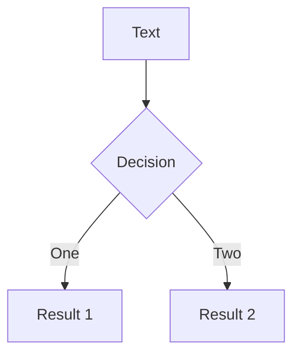
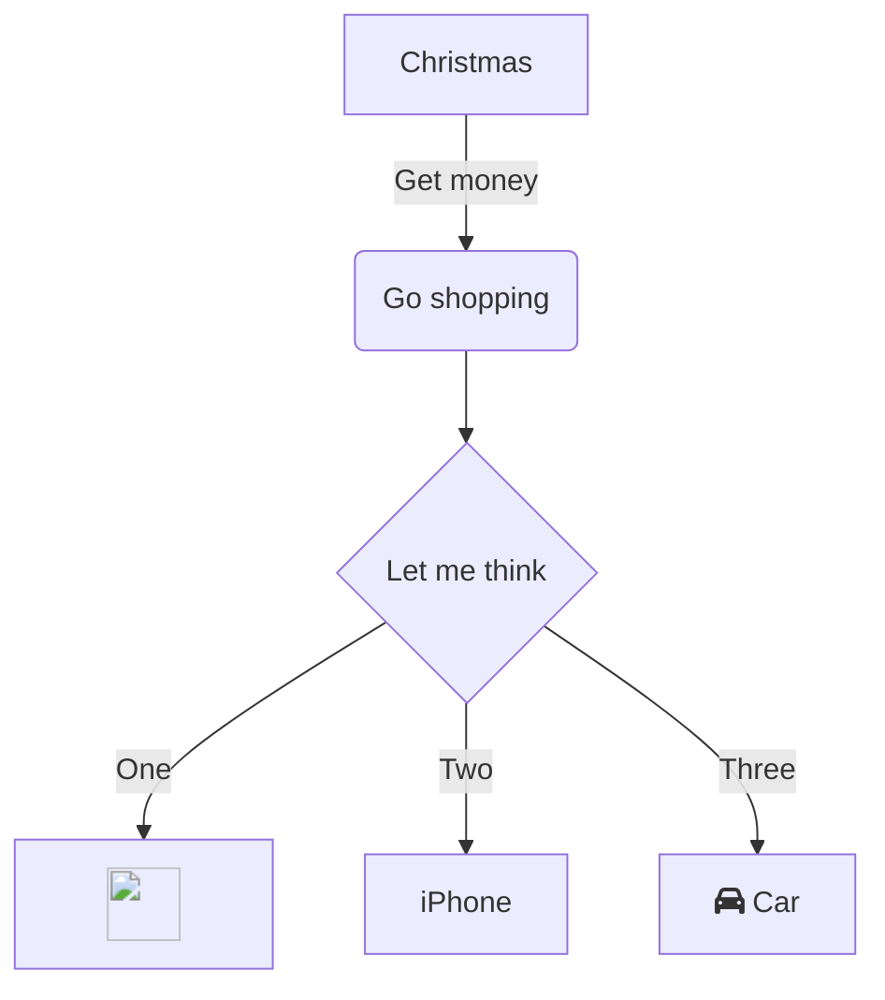

# What is PreProcessing?

PreProcessing covers

- 📝 **Creation** - focus on solid modeling
- 🎨 **Loading** - load geometry
- 🎨 **Repairing** - prepare geometry for meshing
- 🧑‍💻 **Meshing** - the geometry
 
 

These operations may be

- 🈂️ difficult (up to several months to get a descent mesh)
- time and resources consuming 
- highly depends on chosen numerical models

<!--
You can have `style` tag in markdown to override the style for the current page.
Learn more: https://sli.dev/features/slide-scope-style
-->

::right::

<!--

-->

<!--
Here is another comment.
-->
